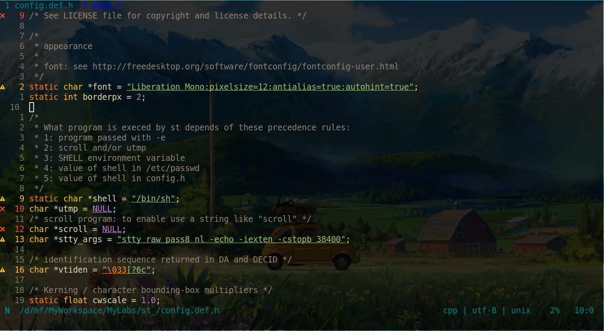
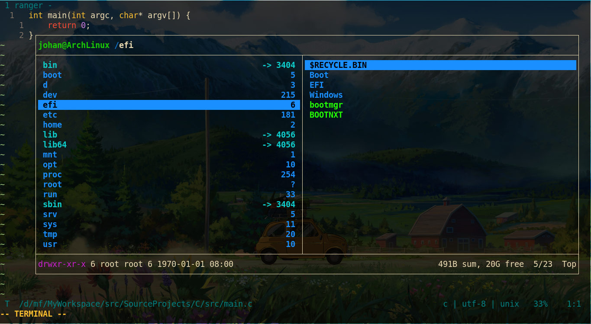
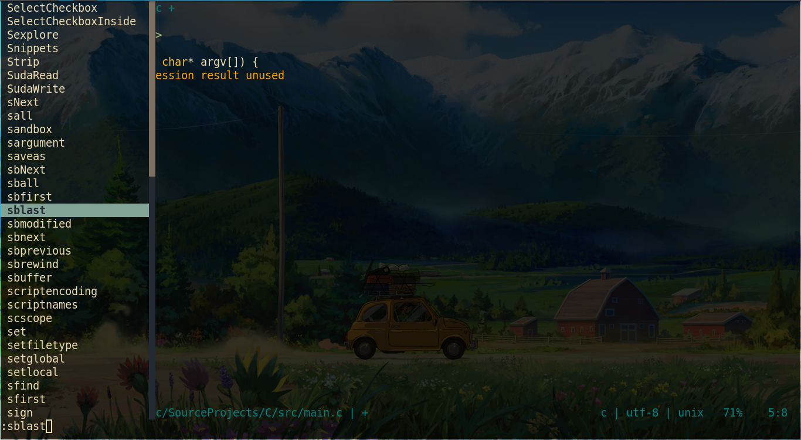

# Vim transparent

If you love transparent term, but your favourite vim color scheme doesn't


# Screenshots

Without vim-transparent (example color scheme is [PaperColor][])


With vim-transparent


[PaperColor]: https://github.com/NLKNguyen/papercolor-theme


## Installation

I recommend to use [Vim-Plug][] to manage plugins.

```vimrc
Plug 'tribela/vim-transparent'
```

[Vim-Plug]: https://github.com/junegunn/vim-plug


## Configuration

### Minimal configuration

```vim
Plug 'tribela/vim-transparent'

" Clear the background of highlight groups in g:transparent_groups.
let g:transparent_groups = ['Normal', 'Comment', 'Constant', 'Special', 'Identifier',
                            \ 'Statement', 'PreProc', 'Type', 'Underlined', 'Todo', 'String',
                            \ 'Function', 'Conditional', 'Repeat', 'Operator', 'Structure',
                            \ 'LineNr', 'NonText', 'SignColumn', 'CursorLineNr', 'EndOfBuffer']
```

### Advanced configuration

The bad thing is something in vim may be not transparent, if you use vim plugins. You can use `:filter /<pattern>/ hi` to find the highlight groups e.g. `:filter /CocList/ hi`, and change it.

For example, I use these plugins, [coc.nvim](https://github.com/neoclide/coc.nvim), [lightline](https://github.com/itchyny/lightline.vim), [rnvimr](https://github.com/kevinhwang91/rnvimr), [fzf.vim](https://github.com/junegunn/fzf), [vim-deus](https://github.com/ajmwagar/vim-deus).

```vim
Plug 'tribela/vim-transparent'

let g:transparent_groups = ['Normal', 'Comment', 'Constant', 'Special', 'Identifier',
                            \ 'Statement', 'PreProc', 'Type', 'Underlined', 'Todo', 'String',
                            \ 'Function', 'Conditional', 'Repeat', 'Operator', 'Structure',
                            \ 'LineNr', 'NonText', 'SignColumn', 'CursorLineNr', 'EndOfBuffer']

" Pmenu
let g:transparent_groups += ['Pmenu']

" coc.nvim
let g:transparent_groups += ['NormalFloat', 'CocFloating']

augroup transparent
    autocmd VimEnter,ColorScheme * call MyTransparent()
augroup END

function! MyTransparent()
    " Customize the highlight groups for transparency in here.

    " CursorLine
    "hi CursorLine ctermfg=NONE ctermbg=239 guibg=NONE guibg=#4e4e4e

    " coc.nvim
    "hi CocMenuSel ctermbg=239 guibg=#4e4e4e
endfunction
```

`vim-deus` configs:

```vim
set t_Co=256
set termguicolors

let &t_8f = "\<Esc>[38;2;%lu;%lu;%lum"
let &t_8b = "\<Esc>[48;2;%lu;%lu;%lum"

" Add `let s:ds.none = ['NONE', 'NONE']` to deus.vim.
let g:deus_sign_column = 'none'

"set background=dark    " Setting dark mode
colorscheme deus
let g:deus_termcolors=256
```

Because of `let g:transparent_groups += ['NormalFloat', 'CocFloating']`, floating windows are transparent. So add borders for those transparent floating windows. Input `:CocConfig` to open the `coc-settings.json`, and add the blew:

```json
    // `:h coc-config-float`
    "suggest.floatConfig": {
        "border": true
    },
    "diagnostic.floatConfig": {
        "border": true
    },
    "signature.floatConfig": {
        "border": true
    },
    "hover.floatConfig": {
        "border": true
    },
```

Make lightline transparent:

```vim
autocmd VimEnter * call SetupLightlineColors()
function SetupLightlineColors() abort
  " transparent background in statusbar
  let l:palette = lightline#palette()

  " `let s:p.{mode}.{where} = [ [ {guifg}, {guibg}, {ctermfg}, {ctermbg} ], ... ]`
  let l:palette.normal = {
          \ 'left': [[ '#008080', 'NONE', 6, 'NONE' ]],
          \ 'middle': [[ '#008080', 'NONE', 6, 'NONE' ]],
          \ 'right': [[ '#008080', 'NONE', 6, 'NONE' ]],
        \ }
  let l:palette.inactive = l:palette.normal
  let l:palette.visual = l:palette.normal
  let l:palette.insert = l:palette.normal
  let l:palette.replace = l:palette.normal
  let l:palette.tabline = {
          \ 'left': [[ '#0000ff', 'NONE', 12, 'NONE' ]],
          \ 'tabsel': [[ '#008080', 'NONE', 6, 'NONE' ]],
          \ 'middle': [[ 'NONE', 'NONE', 'NONE', 'NONE' ]],
          \ 'right': [[ 'NONE', 'NONE', 'NONE', 'NONE' ]],
        \ }

  call lightline#colorscheme()
endfunction

" Comment out the `colorscheme`.
let g:lightline = {
      "\ 'colorscheme': 'deus',
      \ }
```

Rnvimr:

```vim
" Rnvimr background
":hi RnvimrNormal
" show draw border
let g:rnvimr_draw_border = 1
```

fzf.vim:

```vim
":echo g:fzf_colors
" transparent the gutter
let $FZF_DEFAULT_OPTS=$FZF_DEFAULT_OPTS .. ' --color=gutter:-1'
```

### Images

lightline and vim-deus:



coc.nvim floating windows:


coc.nvim CocList:


Rnvimr:



Pmenu:



## Usage

vim-transparent automatically transparent all of highlight settings.

You can disable it by `:TransparentDisable` and re-enable it by `:TransparentEnable`
